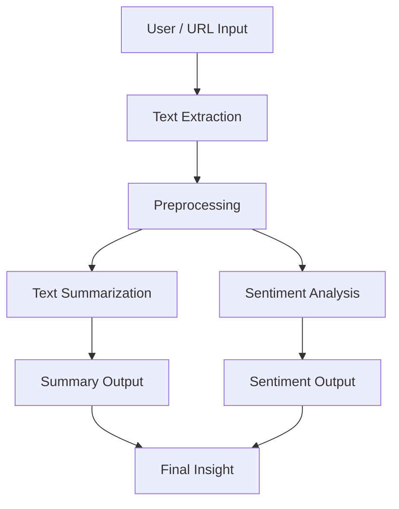
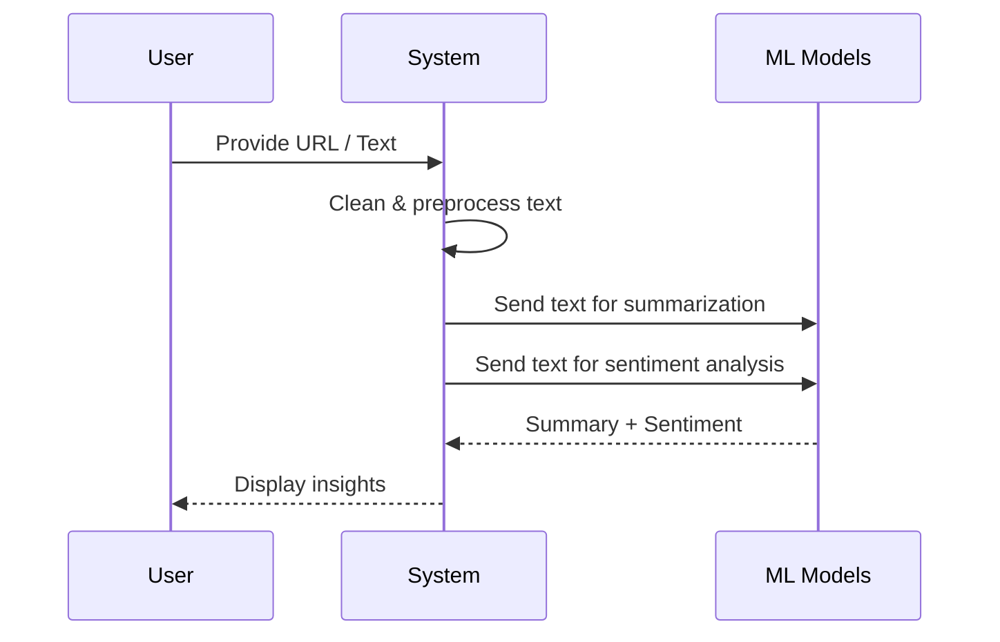
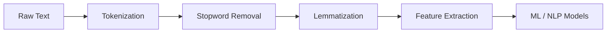

# 📊 Sentiment Analysis & Text Summarization

## 📌 Overview

In today’s digital era, information is primarily accessed through **Uniform Resource Locators (URLs)** over the Internet. Unlike earlier times—when people waited for newspapers to learn about the previous day’s events—information is now available instantly with just a click. 🌐

However, the **volume of information** available online is massive and often overwhelming. Modern users want to **consume more information in less time**, making it inefficient to read lengthy documents end-to-end.

To solve this problem, **text summarization** and **sentiment analysis** play a crucial role:

* **Text Summarization** condenses large documents into concise summaries that capture the core ideas.
* **Sentiment Analysis** identifies emotions and opinions (positive, negative, or neutral) expressed in text.

Together, these techniques help users quickly understand *what* happened and *how people feel about it*.

---

## 🎯 Problem Statement

* Online content (news, blogs, reviews, social media) is growing exponentially.
* Reading full-length articles is time-consuming.
* Users need **quick insights** along with the **emotional context** of the information.

**Goal:**

> Automatically generate concise summaries of textual content and analyze the sentiment behind the information.

---

## 🧠 Key Concepts

### 🔹 Text Summarization

Text summarization extracts or generates a shorter version of a document while preserving its meaning.

**Types:**

* **Extractive Summarization** – Selects key sentences directly from the text.
* **Abstractive Summarization** – Generates new sentences that paraphrase the content.

### 🔹 Sentiment Analysis

Sentiment analysis (also known as opinion mining) detects the **emotional tone** behind textual data.

**Common Sentiment Classes:**

* 😊 Positive
* 😐 Neutral
* 😠 Negative

This is widely used in:

* News analysis
* Product reviews
* Social media monitoring
* Customer feedback systems

---

## 🏗️ System Architecture

---

## ⚙️ Workflow Explanation

---

## 🔄 Data Processing Pipeline

---

## ✅ Benefits

* ⏱️ Saves time by providing quick summaries
* 📈 Improves decision-making with emotional insights
* 🧩 Handles large volumes of text efficiently
* 🤖 Enables automation for news and content platforms

---

## 🚀 Use Cases

* News aggregation platforms
* Financial and market analysis
* Social media sentiment tracking
* Customer review analysis
* Academic and research paper summarization

---

## 🛠️ Technologies (Example)

* **Frontend:** React
* **Backend:** Node.js / Python
* **NLP Libraries:** NLTK, spaCy, Hugging Face Transformers
* **ML Models:** BERT, LSTM, Transformer-based models

---

## 📌 Conclusion

With the explosive growth of online content, **reading everything is no longer practical**. By combining **text summarization** and **sentiment analysis**, this system provides users with **clear, concise, and emotionally-aware insights**, enabling faster and smarter information consumption.

> *Less reading. More understanding.* ✨
